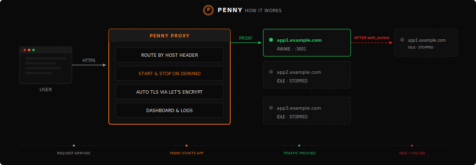

<p align="center">
  
</p>

# penny

Serverless for your servers.

You have a $5 VPS with 10 side projects on it. They all run 24/7 eating memory even though nobody's visiting them. That's wasteful. Penny is a reverse proxy that only starts your servers when they get a request, and kills them after they've been idle. You go from 10 servers running all the time to one reverse proxy that provisions them when they're needed.

Instead of telling penny which address to proxy to, you give it the command to start your server. It runs that command on the first request, waits for a health check, proxies the traffic, and then kills the process after a configurable idle period. Next request comes in, it starts all over again.

## Features

- **On-demand process management** — Servers start on first request, get killed after idle timeout
- **Adaptive idle timeout** — Opt-in traffic-aware shutdown timing that keeps busy apps alive longer and shuts down idle apps faster
- **Automatic TLS** — Let's Encrypt certificates provisioned and renewed automatically
- **Built-in dashboard** — Monitor app runs, uptime, failure rates, and captured logs
- **Health checks** — Configurable endpoints with exponential backoff
- **Cold start loading page** — Opt-in friendly loading page for browser users during cold starts instead of a hanging connection
- **Multi-app routing** — Route multiple domains to different backends from a single config file
- **Single binary** — Dashboard UI embedded in the binary, no external dependencies at runtime


## How It Works

<p align="center">
  
</p>

Each request resets the idle timer. As long as traffic keeps coming, the app stays alive. Once traffic stops, penny waits for `wait_period` and then shuts the process down.

## Quick Start

Create a `penny.toml`:

```toml
["myapp.example.com"]
address = "127.0.0.1:3001"
wait_period = "10m"
health_check = "/"
command = "node server.js"
```

Run it:

```bash
penny serve penny.toml
```

That's it. Requests to `myapp.example.com` will start `node server.js`, proxy traffic to `127.0.0.1:3001`, and kill the process after 10 minutes of inactivity.

## Configuration

### Full Example

```toml
api_address = "0.0.0.0:3031"
api_domain = "penny.example.com"
database_url = "sqlite://penny.db"    # default

[tls]
enabled = true
acme_email = "you@example.com"
# staging = true                      # use Let's Encrypt staging for testing
# certs_dir = "./certs"               # where certs are stored
# renewal_days = 30                   # renew this many days before expiry
# renewal_check_interval_hours = 12   # how often to check for renewals

["app1.example.com"]
address = "127.0.0.1:3001"
command = "node server.js"
health_check = "/"
wait_period = "10m"
# cold_start_page = false
# start_timeout = "30s"
# stop_timeout = "30s"
# health_check_initial_backoff_ms = 10
# health_check_max_backoff_secs = 2

["app2.example.com"]
address = "127.0.0.1:3002"
command = "python app.py"
health_check = "/health"
adaptive_wait = true
# min_wait_period = "5m"             # default
# max_wait_period = "30m"            # default
# low_req_per_hour = 12              # default
# high_req_per_hour = 300            # default
```

### Global Options

| Field | Default | Description |
|-------|---------|-------------|
| `api_address` | — | Address for the dashboard/API server |
| `api_domain` | — | Route the dashboard through the proxy with TLS |
| `database_url` | `sqlite://penny.db` | SQLite database path |

### Per-App Options

| Field | Default | Description |
|-------|---------|-------------|
| `address` | *required* | Address the backend listens on |
| `command` | *required* | Shell command to start the app |
| `health_check` | *required* | HTTP path to check if the app is ready |
| `wait_period` | `10m` | How long to wait after the last request before killing the process |
| `adaptive_wait` | `false` | Enable adaptive idle timeout based on traffic patterns (see below) |
| `min_wait_period` | `5m` | Minimum idle timeout when `adaptive_wait` is enabled |
| `max_wait_period` | `30m` | Maximum idle timeout when `adaptive_wait` is enabled |
| `low_req_per_hour` | `12` | Request rate (req/hr) below which the idle timeout stays at `min_wait_period` |
| `high_req_per_hour` | `300` | Request rate (req/hr) above which the idle timeout stays at `max_wait_period` |
| `start_timeout` | `30s` | Max time to wait for the app to become healthy |
| `stop_timeout` | `30s` | Max time to wait for the app to stop |
| `cold_start_page` | `false` | Show a loading page to browser users during cold starts instead of blocking the connection |
| `health_check_initial_backoff_ms` | `10` | Initial retry delay for health checks |
| `health_check_max_backoff_secs` | `2` | Max retry delay for health checks |

### TLS Options

| Field | Default | Description |
|-------|---------|-------------|
| `enabled` | `false` | Enable automatic TLS |
| `acme_email` | *required* | Contact email for Let's Encrypt |
| `staging` | `false` | Use Let's Encrypt staging environment |
| `certs_dir` | `./certs` | Directory to store certificates |
| `renewal_days` | `30` | Renew certificates this many days before expiry |
| `renewal_check_interval_hours` | `12` | How often to check for renewals |

### Adaptive Wait

When `adaptive_wait = true`, penny adjusts the idle timeout based on recent traffic instead of using a fixed `wait_period`. Busier apps stay alive longer; idle apps shut down faster.

It works by computing request rates over two time windows:
- **Short window (5 min)** — reacts quickly to traffic bursts
- **Long window (30 min)** — captures sustained traffic patterns

The higher of the two rates is mapped to a wait period between `min_wait_period` and `max_wait_period` using a smooth S-curve (smoothstep). The `low_req_per_hour` and `high_req_per_hour` thresholds control where the curve starts and saturates.

```toml
# Minimal — just enable it, defaults handle the rest
["myapp.example.com"]
address = "127.0.0.1:3001"
command = "node server.js"
health_check = "/"
adaptive_wait = true

# High-traffic API with custom thresholds
["api.example.com"]
address = "127.0.0.1:3002"
command = "python app.py"
health_check = "/health"
adaptive_wait = true
min_wait_period = "5m"
max_wait_period = "60m"
low_req_per_hour = 60
high_req_per_hour = 3000
```

When `adaptive_wait` is enabled, `wait_period` is ignored.

## CLI

### `penny serve`

Start the reverse proxy.

```
penny serve <config> [OPTIONS]

Options:
  --address <ADDR>         HTTP listen address [default: 0.0.0.0:80]
  --https-address <ADDR>   HTTPS listen address [default: 0.0.0.0:443]
  --no-tls                 Disable TLS even if configured in the config file
  --password <PASSWORD>    Password for dashboard access [env: PENNY_PASSWORD]
```

### `penny check`

Validate your configuration by starting each app, running its health check, and stopping it.

```
penny check <config> [OPTIONS]

Options:
  --apps <HOSTS>    Comma-separated list of specific apps to check
```

## Dashboard

Penny includes a built-in web dashboard (served at the `api_address` or through the proxy via `api_domain`). It shows:

- Total and per-app run counts, uptime, and failure rates
- Run history with start/stop times and durations
- Captured stdout/stderr logs for each run
- Time-range filtering for all metrics

Protect the dashboard with a password:

```bash
penny serve penny.toml --password mysecret
# or
PENNY_PASSWORD=mysecret penny serve penny.toml
```

## Building from Source

Requires Rust (2024 edition) and [pnpm](https://pnpm.io/) for the UI.

```bash
# Build the dashboard UI
cd ui && pnpm install && pnpm build && cd ..

# Build penny
cargo build --release
```

The binary will be at `target/release/penny`.
